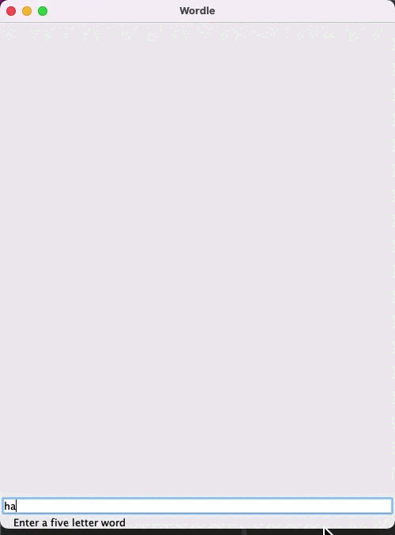

# Wordle

Guess the five letter hidden word in six tries. You will get three different clues each time you enter a guess. Green letter means that it's in the word and in the right position. Yellow letter means it's in the word but not the right position. Lastly, a gray letter means it's not in the word at all.

---

